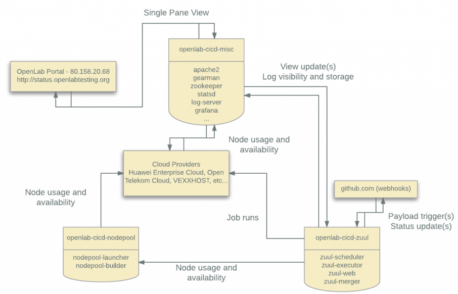

# Development Guide

## Prerequisites

The OpenLab CI is built based on `NodePool` and `Zuul` tools of the OpenStack infrastructure. The CI jobs definition uses Ansible playbooks. Learn more about the tools first:

* Zuul documentation is hosted on [Zuul](https://zuul-ci.org)
* NodePool documentation is hosted on [NodePool](https://zuul-ci.org/docs/nodepool/)
* Ansible documentation is hosted on [Ansible Docs](https://docs.ansible.com/)

### Testing workflow

### OpenLab CI arch

## Working on test request with OpenLab CI

The accepted test requests can be found in [TODO list](https://github.com/orgs/theopenlab/projects/1#column-1860008), developers can get start with following steps:

1. Pick one test request you wish to work on, move it to [IN PROGRESS list](https://github.com/orgs/theopenlab/projects/1#column-1860011), edit it to add the development plan into comments
2. The target project of the request should install the **OpenLab-CI** [github APP](https://github.com/apps/theopenlab-ci), so that OpenLab CI system and target project can communicate with each other. See the details in [connecting guideline](connect-to-openlab.md)
3. Fork your own copy of the CI job repository [openlab-zuul-jobs](https://github.com/theopenlab/openlab-zuul-jobs) to your account, develop the test job and submit a PR\(Pull Request\) to [openlab-zuul-jobs](https://github.com/theopenlab/openlab-zuul-jobs). In order to manage the test request well, please add change details and link the test request number in PR's commit message, the format like:

   `Related-Bug: theopenlab/openlab#number`

4. OpenLab development team @theopenlab/dev will review the PR and give some suggestion, development core team @theopenlab/dev-core have permission to merge it if there is no issue, at the meanwhile, you should contact @theopenlab/dev-core to add the target project into **main.yaml** in **zuul** node if it is not in project list of zuul
5. When your PR is merged into master of [openlab-zuul-jobs](https://github.com/theopenlab/openlab-zuul-jobs), trigger to test the integration job by [trigger comments](supported-trigger-comments.md), see the [build status](http://status.openlabtesting.org/builds), click result `FAILURE` enter the build web page and then click the `log url` to get the log details if the job fail. Maybe you can find some problems of job, feel free to submit new pull request to [openlab-zuul-jobs](https://github.com/theopenlab/openlab-zuul-jobs/pulls) to fix job issue, link the issue number of related test request in PR's commit message as we do on step3  
6. Close the `In Progress` test request by yourself when the work completely, notify @theopenlab/governance and @theopenlab/docs to update website and documents in RP comments.

## Working on test request with OpenLab physical machine

1. If your test request need some physical machines, please contact @theopenlab/governance members in IRC channel or send them an email, they will help you to get OpenLab dedicated resources to launch testing
2. When you can access the physical machines, move your test request to [IN PROGRESS list](https://github.com/orgs/theopenlab/projects/1#column-1860011), edit it to add the development plan into comments
3. When the work is completely, close the `In Progress` test request by yourself, please commit the test result into comments of test request related issue. A blog also is a good choice to show more details of testing. Notify @theopenlab/governance and @theopenlab/docs to update website and documents in RP comments.

## Working on Bug

1. Bug reports for OpenLab are tracked in [bug list](https://github.com/theopenlab/openlab/issues) 
2. Perhaps the merged CI job will fail due to some reasons after it has been running for some time, or if you find any other problems of OpenLab, welcome to [new](https://github.com/theopenlab/openlab/issues/new?template=report-bug.md&labels=bug) an issue
3. The development core team @theopenlab/dev-core will confirm the bugs, add them into [TODO list](https://github.com/orgs/theopenlab/projects/1#column-1860008)
4. You can assign one bug from TODO list, move the bug to [IN PROGRESS list](https://github.com/orgs/theopenlab/projects/1#column-1860011). Feel free to pick up the issues with label [need volunteer](https://github.com/theopenlab/openlab/labels/need%20volunteer), these issues are not claimed by anyone yet 
5. Submit a PR\(Pull Request\) to [openlab-zuul-jobs](https://github.com/theopenlab/openlab-zuul-jobs) to fix bug, please add change details and link the bug number in PR's commit message:

   `Related-Bug: theopenlab/openlab#number`

6. OpenLab development team @theopenlab/dev will review the PR and give some suggestion, development core team @theopenlab/dev-core have permission to merge it if there is no issue. When the PR is merged into openlab-zuul-jobs, you can test jobs by [trigger comments](supported-trigger-comments.md)
7. Close the `In Progress` bug by yourself when the bug is fixed.

